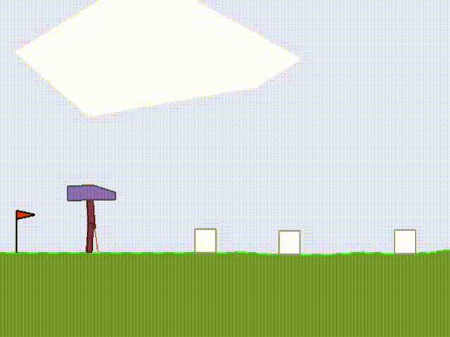

# MDPFuzz: Testing Models Solving Markov Decision Processes.
------
Official implementation of **ISSTA 2022** paper: *MDPFuzz: Testing Models Solving Markov Decision Processes*.

Paper link: [paper](https://dl.acm.org/doi/abs/10.1145/3533767.3534388)

Website link: [MDPFuzz](https://sites.google.com/view/mdpfuzz/evaluation-results?authuser=0)

----
**Crash-triggering states found by MDPFuzz**:

<p align="middle">



</p>

For more results, please refer to our [website](https://sites.google.com/view/mdpfuzz/evaluation-results?authuser=0).

----

We evaluate *MDPFuzz* on five SOTA models solving MDPs.

We include the core components of *MDPFuzz* in the `fuzz` folders under the five folders of different models and scenarios [ACAS_Xu](./ACAS_Xu/), [IL_CARLA](./IL_CARLA/), [MARL_CoopNavi](./MARL_CoopNavi/), [RL_BipedalWalker](./RL_BipedalWalker/), [RL_CARLA](./RL_CARLA/).

We present the instructions on launching *MDPFuzz*, analyzing the root cause, and repairing the models in different scenarios in `READMEs` under these five folders. 

We also append a [detailed algorithm](./Detailed%20Algorithms.pdf) for your reference.

We run our experiments on AMD Ryzen CPU, 256GB RAM, and Nvidia GeForce RTX 3090 GPU. 

----
##  DNN ACAS Xu

#### *Instructions on launching *MDPFuzz* for DNN models ACAS Xu*

#### Setting up environment:

Run the following:
```bash
cd ./ACAS_Xu
conda create -n acas python=3.7.9
conda env update --name acas --file environment_ACAS.yml
conda activate acas
```

#### Notes:
The core code of *MDPFuzz* is in `./ACAS_Xu/fuzz/fuzz.py`. 

`./simulate.py` is the main simulation code for ACAS Xu.

All models including ACAS Xu models and models after repair are inside `./models`.

#### Fuzz testing:
Run `python simulate.py` to start fuzz testing.

We set a default terminate running time for 1 hour with 50 initial seeds. You may adjust the time to 6 hours with 500 initial seeds by `python simulate.py --terminate 6 --seed_size 500`.

#### Repair models:
After fuzz testing, we can repair the models using the crash-triggering inputs found by *MDPFuzz*.

The corresponding code is `./repair.py`.

Run `mkdir checkpoints` and `python repair.py` to repair the models using the crash-triggering state sequences found by *MDPFuzz*, the repaired model will be stored in the folder `checkpoints`.

To evaluate the performance of the repaired models, just replace the corresponding original models with the repaired models, and then run fuzz testing again. We have provided the repaired models in the folder `./models/` for your reference.

#### Root cause:
Run `python Tsne.py` to see the visualization results of projecting states to 2-dimentional spaces using TSNE.

We provide our crash-triggering and normal data in folder `./results/`, and you can also use the states selected by your own and use `Tsne.py` to plot the figures.

----

##  RL CARLA

#### *Instructions on launching *MDPFuzz* for Reinforcement Learning models for CARLA*

#### Notes:
The core code of *MDPFuzz* is in `./RL_CARLA/fuzz/fuzz.py`. 

The RL model we evaluate is borrowed from this awesome repository: https://github.com/valeoai/LearningByCheating.

Part of the `PythonAPI` and the map rendering code is borrowed from the official [CARLA](https://github.com/carla-simulator/carla) repo, which is under MIT license.

#### Setting up environment:

Run the following:
```bash
cd RL_CARLA
# Setup CARLA
wget http://carla-assets-internal.s3.amazonaws.com/Releases/Linux/CARLA_0.9.6.tar.gz
mkdir carla_RL_IAs
tar -xvzf CARLA_0.9.6.tar.gz -C carla_RL_IAs
cd carla_RL_IAs
wget http://www.cs.utexas.edu/~dchen/lbc_release/navmesh/Town01.bin
wget http://www.cs.utexas.edu/~dchen/lbc_release/navmesh/Town02.bin
mv Town*.bin CarlaUE4/Content/Carla/Maps/Nav/
cd PythonAPI/carla/dist
rm carla-0.9.6-py3.5-linux-x86_64.egg
wget http://www.cs.utexas.edu/~dchen/lbc_release/egg/carla-0.9.6-py3.5-linux-x86_64.egg

# Setup environment
conda create -n carla_RL_IAs python=3.5.6

easy_install carla-0.9.6-py3.5-linux-x86_64.egg

cd ../../..

conda env update --name carla_RL_IAs --file environment_carlarl.yml
conda activate carla_RL_IAs

# Download models
wget https://github.com/marintoro/LearningByCheating/releases/download/v1.0/model_RL_IAs_only_town01_train_weather.zip
unzip model_RL_IAs_only_town01_train_weather.zip

wget https://github.com/marintoro/LearningByCheating/releases/download/v1.0/model_RL_IAs_CARLA_Challenge.zip
unzip model_RL_IAs_CARLA_Challenge.zip
```

#### Fuzz testing:
First run `./carla_RL_IAs/CarlaUE4.sh -fps=10 -benchmark -carla-port=3000` to start the CARLA environment.

Run `python benchmark_agent.py --suite=town2 --max-run 100 --path-folder-model model_RL_IAs_only_town01_train_weather/ --crop-sky --emguide --port=3000` to start fuzzing.

We set a default terminate running time for 1 hour with 50 initial seeds. You may adjust the setting accordingly in `./benchmark/run_benchmark.py`.

#### Root cause:
Run `python Tsne.py` to see the visualization results of projecting states to 2-dimentional spaces using TSNE.

We provide our crash-triggering and normal data in folder `./results/`, and you can also use the states selected by your own and then use `Tsne.py` to plot the figures.

----
##  IL CARLA

#### *Instructions on launching *MDPFuzz* for  Imitation Learning models for CARLA*

#### Notes:
The core code of *MDPFuzz* is in `./IL_CARLA_carla_lbc/fuzz/fuzz.py`. 

The RL model we evaluate is borrowed from this awesome repository: https://github.com/dotchen/LearningByCheating, which is under MIT license.

Part of the `PythonAPI` and the map rendering code is borrowed from the official [CARLA](https://github.com/carla-simulator/carla) repo, which is under MIT license.

#### Setting up environment:

We recommend to setup environment for *RL_CARLA* first, as the *CARLA* can be reused.

Run the following:
```bash
# Setup CARLA
cd PythonAPI/carla/dist
wget http://www.cs.utexas.edu/~dchen/lbc_release/egg/carla-0.9.6-py3.5-linux-x86_64.egg

# Setup environment
conda create -n carlaIL python=3.5.6

easy_install carla-0.9.6-py3.5-linux-x86_64.egg

cd ../../..

conda env update --name carlaIL --file environment_carlail.yml
conda activate carlaIL

# Download models
mkdir -p ckpts/image
cd ckpts/image
wget http://www.cs.utexas.edu/~dchen/lbc_release/ckpts/image/model-10.th
wget http://www.cs.utexas.edu/~dchen/lbc_release/ckpts/image/config.json
cd ../..
mkdir -p ckpts/priveleged
cd ckpts/priveleged
wget http://www.cs.utexas.edu/~dchen/lbc_release/ckpts/privileged/model-128.th
wget http://www.cs.utexas.edu/~dchen/lbc_release/ckpts/privileged/config.json
cd ../..
```

#### Fuzz testing:
First run `../../RL_CARLA/carla_RL_IAs/CarlaUE4.sh -fps=10 -benchmark -carla-port=3000` to start the CARLA environment.

Run `python ./benchmark_agent.py --suite=town2 --model-path=ckpts/image/model-10.th --emguide` to start fuzzing.

We set a default terminate running time for 1 hour with 50 initial seeds. You may adjust the setting accordingly in `./benchmark/run_benchmark.py`.

#### Root cause:
Run `python Tsne.py` to see the visualization results of projecting states to 2-dimentional spaces using TSNE.

We provide our crash-triggering and normal data in folder `./results/`, and you can also use the states selected by your own and use `Tsne.py` to plot the figures.

----
##  MARL Coop Navi

#### *Instructions on launching *MDPFuzz* for   Multi-Agent Reinforcement Learning models for Coop-Navi*

#### Notes:

The core component of *MDPFuzz* is in the folder `./MARL_CoopNavi/maddpg/experiments/fuzz/`.

The MARL algorithm is in the folder `./MARL_CoopNavi/maddpg`.

The Coop Navi environment is in the folder `./MARL_CoopNavi/multiagent-prticle-envs`.

The MARL model we evaluate is borrowed from this awesome repository: https://github.com/openai/maddpg, which is under MIT license.

The Coop Navi environment is installed according to this repository: https://github.com/openai/multiagent-particle-envs, which is under MIT license.

#### Setting up environment:

```bash
cd ./MARL_CoopNavi
conda create -n MARL python=3.5.4
conda env update --name MARL --file environment_MARL.yml
conda activate MARL

cd ./maddpg
pip install -e .
cd ../multiagent-particle-envs
pip install -e .
cd ../maddpg/experiments/
```

#### Train the model:

We first train the MARL model according to the paper [Multi-Agent Actor-Critic for Mixed Cooperative-Competitive Environments](https://arxiv.org/pdf/1706.02275.pdf) and the repository https://github.com/openai/maddpg.

We provide our trained model in `./maddpg/checkpoints`. Users can also follow the [instructions](./README-maddpg.md) to train their own models.

#### Fuzz testing:

Check the default path of the model is correct in `./testing.py`. 

Run `python testing.py` to start fuzz testing.

#### Root cause:

Run `python Tsne.py` to see the visualization results of projecting states to 2-dimentional spaces using TSNE.

We provide our crash-triggering and normal data in folder `./results/`, and you can also use the states selected by your own and use `Tsne.py` to plot the figures.

----
##  RL BipedalWalker

#### *Instructions on launching *MDPFuzz* for   Reinforcement Learning models for BipedalWalker*

#### Notes:

The core component of *MDPFuzz* is in the folder `./RL_BipedalWalker/rl-baselines3-zoo/fuzz/`.

The RL algorithm is in the folder `./RL_BipedalWalker/rl-baselines3-zoo`.

The RL model we evaluate is borrowed from these awesome repositories: https://github.com/DLR-RM/rl-baselines3-zoo, https://github.com/DLR-RM/rl-trained-agents, which are under MIT license.

#### Setting up environment:

Run the following:
```bash
cd ./RL_BipedalWalker
# Setup environment
conda create -n RLWalk python=3.6.3
conda env update --name RLWalk --file environment_RLWalk.yml
conda activate RLWalk
cp ./gym/setup.py ./
pip install -e .
cp ./stable_baselines3/setup.py ./
pip install -e .

# Download trained models
cd ./rl-baselines3-zoo
git clone https://github.com/DLR-RM/rl-trained-agents
```

#### Fuzz testing:

Check the default path of the model is correct in `./enjoy.py`. 

Run `python enjoy.py --alg tqc --env BipedalWalkerHardcore-v3 --folder rl-trained-agents/ --em --no-render` to start fuzz testing.

#### Root cause:

Run `python Tsne.py` to see the visualization results of projecting states to 2-dimentional spaces using TSNE.

We provide our crash-triggering and normal data in folder `./results/`, and you can also use the states selected by your own and use `Tsne.py` to plot the figures.


----
#### Reference

* https://github.com/valeoai/LearningByCheating
* https://github.com/carla-simulator/carla
* https://github.com/dotchen/LearningByCheating
* https://github.com/DLR-RM/rl-baselines3-zoo
* https://github.com/DLR-RM/rl-trained-agents
* https://github.com/openai/maddpg
* https://github.com/openai/multiagent-particle-envs

----
#### Citation

```bash
@inproceedings{10.1145/3533767.3534388,
author = {Pang, Qi and Yuan, Yuanyuan and Wang, Shuai},
title = {MDPFuzz: Testing Models Solving Markov Decision Processes},
year = {2022},
isbn = {9781450393799},
publisher = {Association for Computing Machinery},
address = {New York, NY, USA},
url = {https://doi.org/10.1145/3533767.3534388},
doi = {10.1145/3533767.3534388},
booktitle = {Proceedings of the 31st ACM SIGSOFT International Symposium on Software Testing and Analysis},
pages = {378–390},
numpages = {13},
keywords = {Markov decision procedure, Deep learning testing},
location = {Virtual, South Korea},
series = {ISSTA 2022}
}
```

----
#### License

[MIT LICENSE](./LICENSE).
